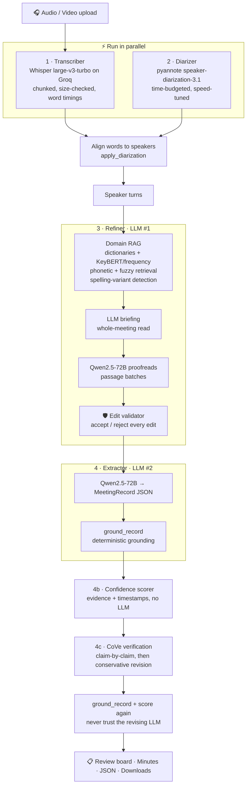

<div align="center">

# 🎙️ AI Meeting Assistant

### Drop in a meeting recording. Get back a clean transcript, who said what, decisions, action items with owners and deadlines, and a confidence score for every claim, with a click-to-listen timestamp to prove it.


**🧠 Domain-aware RAG proofreading · 🗣️ Speaker-grounded owners · 🛡️ Anti-hallucination at 3 layers · 🎯 Evidence-based confidence tiers**

</div>

---

## ✨ Why this project is different

Most "AI meeting notes" tools are a single prompt: *audio → transcript → summarize*. That fails in predictable ways. They mishear jargon, they can't tell who said "I'll do it", they turn a casual suggestion into a "decision", and they invent owners and deadlines.

This project is a **multi-stage, verifiable pipeline** built around one rule: **the transcript is the only source of truth.**

| Problem with typical tools | What this pipeline does |
|---|---|
| "Kubernetes" becomes "cooper netties" | **Domain-RAG refiner**: dictionaries, phonetic (Metaphone) and fuzzy retrieval, plus an LLM briefing, then a *deterministic edit validator* |
| "I'll send it by Friday". Who is *I*? | **pyannote diarization**: first-person commitments are tied to the speaker who said them |
| A suggestion is reported as a decision | Strict `agreed` vs `proposed` definitions, **downgraded in code** if the quote can't be verified |
| LLM invents owners / deadlines | Owners and deadlines must literally appear in the transcript, otherwise **`Unspecified`** |
| "The model is 95% sure" (it isn't) | **Deterministic confidence scorer**: the LLM reports evidence *features*; code computes the score |
| You have to trust the output | Every item has a **timestamp and ▶ button**, so you can hear the moment yourself |
| Hallucinated summary lines | **Chain-of-Verification (CoVe)** checks every claim independently against retrieved transcript evidence |

---

## 🏗️ Architecture



### The pipeline, stage by stage

#### 🎤 Stage 1: Transcription (`transcriber.py`)
- **Model:** `whisper-large-v3-turbo` served by **Groq**.
- **Validation:** checks the file exists, has a supported extension, is non-empty, decodable, contains audio, and is between 1 s and 2 h.
- **Normalisation:** `ffmpeg` converts to 16 kHz mono FLAC (lossless and small).
- **Chunking:** about 10-minute chunks with 3 s overlap. Every word and segment is *owned* by exactly one chunk (by its midpoint), so overlap never duplicates text.
- **Upload-limit safe:** each chunk is size-checked against Groq's 25 MB limit. It is re-encoded (FLAC → 64 kbps MP3 → 32 kbps), and as a last resort split in half. A 25-minute, 260 MB WAV works.
- **Timings:** requests word- and segment-level timestamps (with a segment-only fallback). Timings are used internally for speaker alignment and audio seek.
- **Hallucination filter:** drops silence-hallucinations (high `no_speech_prob` plus low log-prob) and runaway repeats.
- **ASR clarity:** Whisper's `avg_logprob` becomes a per-paragraph *clarity* score, used later to flag poorly-heard decisions.
- **Turn building:** groups fragments into readable paragraphs and speaker turns.

#### 🗣️ Stage 2: Speaker diarization (`diarizer.py`), optional
- **Model:** `pyannote/speaker-diarization-3.1` (gated on Hugging Face).
- **Word-level alignment:** each Whisper *word* is assigned to the speaker who talks most during it. One- or two-word "flickers" are smoothed, and segments are split where the speaker changes. Speakers are renamed `Speaker 1, 2, …` by first appearance.
- **Never fatal:** if diarization fails or is skipped, the pipeline continues without speaker labels.

**⚡ Speed engineering (built for CPU deployment):**

| Technique | Effect |
|---|---|
| Wider sliding-window step (`fast` = 5 s instead of 1 s) | ~5× fewer speaker embeddings, the dominant cost |
| Larger segmentation / embedding batch sizes | Better throughput |
| Affinity-aware CPU thread pinning | Avoids oversubscription on containers |
| **Time budget** (default 900 s on CPU) | If too slow, aborts cleanly via pyannote's hook and continues *without* labels |
| Real progress via pyannote hook | Live progress bar |
| **Runs in parallel with transcription** | Wall-clock ≈ max(STT, diarization) instead of the sum |
| GPU auto-detect | Uses `accurate` settings and no time limit on CUDA |

#### 🧠 Stage 3: Domain-aware refinement, LLM #1 (`refiner.py` + `domain_kb.py`)
A **retrieval-augmented proofreader**. No vector DB, just fast deterministic retrieval:

1. **Keyphrases:** KeyBERT (semantic, optional) or a frequency-based fallback.
2. **Domain routing:** dictionaries in `domain_kb/*.json` switch on when enough of their cue words appear.
3. **Retrieval:** every 1-4 word span of the transcript is compared with every dictionary term and its known mis-hearings by **exact alias**, **phonetic (Metaphone via `jellyfish`)** and **character similarity (`rapidfuzz`)**. Speech errors are errors of *sound*.
4. **Self-consistency:** detects the same word spelled several ways inside the transcript ("Tarian" / "Terrian").
5. **LLM briefing (optional):** the model reads the whole meeting first and reports domain, people, places and suspected mis-recognitions. A suspected misrecognition is accepted only if the "heard" words verbatim exist in the transcript.
6. **Proofreading:** Qwen2.5-72B receives passages plus the glossary and suspect spans.
7. **🛡️ Edit validator** (`validate_refinement`): the LLM's output is *diffed* against the raw text and **every edit is accepted or rejected individually**:
   - ❌ numbers, dates, amounts, negations and modal verbs must not change
   - ❌ no deleting content words, no big rewrites, no turning one person into another
   - ❌ no lower-casing names or acronyms
   - ✅ terminology edits are accepted only when backed by glossary, dictionary or transcript evidence
   - ✅ grammar, spelling, capitalisation, punctuation, fillers and stutters are accepted when safe

   Rejected edits are logged with the reason, so nothing is silently lost or invented.

#### 📝 Stage 4: Documentation, LLM #2 (`extractor.py`)
A **separate** LLM call with its own contract produces one canonical `MeetingRecord` (Pydantic), rendered both as JSON and Markdown:
- summary, key topics, chronological minutes
- **decisions** with `agreed` vs `proposed`, verbatim `source_quote` and `agreement_quote`
- **action items** with owner, `owner_basis` (`named` / `first_person`), deadline (as spoken) and status (`assigned` / `proposed` / `unspecified`)
- speaker identities, but only when the transcript reveals a name (self-introduction, or being addressed by name)
- long meetings use map-reduce over chunks

**Deterministic grounding** (`ground_record`) runs after the LLM:
- evidence quotes must really occur in the transcript, otherwise the item is downgraded or cleared
- an owner must be a name found in the transcript, or a `Speaker N` label whose *own turn* contains the first-person commitment
- a deadline's words must appear in the transcript
- speaker names need a verifiable quote

#### 🎯 Stage 4b: Confidence scoring (`confidence.py`), no LLM
LLM self-reported confidence is badly calibrated, so the work is split. The **LLM only reports evidence features** (agreement signal, objection, hedging, acceptance). **Code computes the score** from:
- is the quote verifiably in the transcript, and *where* in the audio (timestamp interpolation)?
- lexical cues (formal settlement words, assent, push-back, hedges, first-person commitment phrases) used to cross-check the LLM's features
- did a *different* speaker acknowledge it?
- Whisper clarity of the passage
- did the refiner change words inside the quote?

| Tier | Score | Meaning |
|---|---|---|
| 🟢 **Confirmed** | ≥ 80 | Explicitly settled or accepted, quote verified, audio clear |
| 🔵 **High chance** | 60-79 | Agreed or accepted, but implicitly or with one weaker signal |
| 🟠 **Ambiguous** | 40-59 | Mixed signals: push-back, hedging, unclear audio, or a well-supported proposal |
| 🔴 **Low chance** | < 40 | Only suggested or weakly evidenced, treat as an open idea |

**Hard rules:** a *proposal* is capped at 55 and never rises above Ambiguous. "Confirmed" requires explicit settlement or explicit acceptance by a stated owner. An unresolved objection forces Ambiguous. Unclear audio caps at High chance. The score never exceeds 97, so you are always invited to verify. Every point added or removed is shown in a **"Why this score?"** panel.

#### 🔍 Stage 4c: Chain-of-Verification (`verification.py`)
Factored **CoVe**, adapted for meetings:
1. Break the draft record into **atomic claims** (summary sentences, minutes bullets, decisions, owners, deadlines).
2. **Retrieve** transcript evidence for each claim.
3. **Verify each claim independently** (parallel calls). The verifier **never sees the draft record**, only one claim plus evidence. Verdict: `supported` / `contradicted` / `insufficient`. Quotes must literally appear in the evidence.
4. **Conservatively revise** the record: remove unsupported claims, never invent replacements.
5. Run `ground_record` and the confidence scorer **again**, because the revising LLM is not trusted either.

---

## 🖥️ The App (`app.py`)

A Streamlit review console with 8 tabs:

| Tab | What you get |
|---|---|
| 1 · Raw transcript | Whisper output, speaker-labelled, optional timestamps |
| 2 · Refined transcript | Refined text, **Listen by paragraph**, side-by-side word diff, applied corrections, rejected edits |
| 3 · Domain context | Detected domains, keyphrases, injected glossary, suspect spans, spelling variants, LLM briefing |
| 4 · Speakers | Talk-time stats and identified names with evidence |
| 5 · Decisions & tasks review | Confidence-tiered cards, **▶ click-to-listen** buttons, "Why this score?" |
| 6 · Meeting minutes | Polished Markdown minutes |
| 7 · Verification | CoVe results with evidence quotes and play buttons |
| 8 · Structured JSON | The canonical machine-readable record |

📦 **Downloads:** raw / refined / timestamped transcripts, minutes (`.md`), record (`.json`), refinement report (`.json`), verification (`.json`), or **everything as a `.zip`**.

---

## 🧰 Tech stack

| Layer | Technology |
|---|---|
| UI | **Streamlit** (≥ 1.37) |
| Speech-to-text | **Whisper large-v3-turbo** via **Groq** API |
| Speaker diarization | **pyannote.audio** `speaker-diarization-3.1` + **PyTorch** |
| LLMs | **Qwen2.5-72B-Instruct** via **OpenRouter** (any OpenAI-compatible endpoint works) |
| Audio processing | **ffmpeg / ffprobe** |
| Schemas and validation | **Pydantic v2** |
| Fuzzy / phonetic matching | **rapidfuzz**, **jellyfish** (Metaphone) |
| Keyphrases | **KeyBERT** (optional) or built-in frequency fallback |
| Config | `python-dotenv`, Streamlit secrets, environment variables |
| Concurrency | `ThreadPoolExecutor` (diarization ∥ transcription, parallel CoVe checks) |

---

## 📁 Project structure

```
.
├── app.py                 # Streamlit UI + pipeline orchestration (STT ∥ diarization)
├── transcriber.py         # Stage 1 · Groq Whisper, chunking, validation, turn building
├── diarizer.py            # Stage 2 · pyannote, speed tuning, time budget, word-speaker alignment
├── refiner.py             # Stage 3 · LLM #1 proofreader, edit validator, shared LLM helpers
├── domain_kb.py           # Domain retrieval: dictionaries, phonetic/fuzzy match, variants
├── extractor.py           # Stage 4 · LLM #2 → MeetingRecord, deterministic grounding, rendering
├── confidence.py          # Stage 4b · evidence + confidence scoring (no LLM)
├── verification.py        # Stage 4c · Chain-of-Verification
├── domain_kb/             # Domain dictionaries (*.json) + custom/*.txt (always active)
├── .streamlit/
│   └── config.toml        # raises the upload size limit for long recordings
├── requirements.txt
├── packages.txt           # apt packages for Streamlit Cloud (ffmpeg)
├── secrets.toml.example   # template for secrets, safe to commit
└── .gitignore             # keeps .env and secrets.toml out of Git
```

### 📚 Adding your own domain knowledge
Create `domain_kb/<name>.json`:
```json
{
  "domain": "devops",
  "title": "DevOps & Cloud",
  "description": "Infrastructure and deployment jargon",
  "cues": ["deploy", "cluster", "pipeline", "container"],
  "terms": [
    {"term": "Kubernetes", "expansion": "container orchestration", "aliases": ["cooper netties", "kubernetes"], "note": ""}
  ]
}
```
A domain switches on when at least 3 of its cue words occur in the transcript, and the top 4 domains are used. Files in `domain_kb/custom/*.txt` are **always on**, one term per line in the form `Term`, `alias -> Term`, or `Term | alias one; alias two | note`. Users can also paste terms in the sidebar at run time.

---

## 🚀 Run it locally

```bash
# 1. Clone
git clone https://github.com/<you>/<repo>.git && cd <repo>

# 2. ffmpeg (required)
#   macOS: brew install ffmpeg | Ubuntu: sudo apt install ffmpeg | Windows: winget install ffmpeg

# 3. Python deps
python -m venv .venv && source .venv/bin/activate      # Windows: .venv\Scripts\activate
pip install -r requirements.txt
#   optional, semantic keyphrases (large download): pip install keybert

# 4. Secrets: create a .env (git-ignored) in the project root
cat > .env <<'EOF'
GROQ_API_KEY=gsk_...
OPENROUTER_API_KEY=sk-or-v1-...
HF_TOKEN=hf_...
EOF

# 5. Launch (run from the repo root so .streamlit/config.toml is picked up)
streamlit run app.py
```

### 🔑 Getting the keys
| Key | Where | Used for |
|---|---|---|
| `GROQ_API_KEY` | [console.groq.com](https://console.groq.com) | Whisper transcription |
| `OPENROUTER_API_KEY` | [openrouter.ai/keys](https://openrouter.ai/keys) | Qwen2.5-72B (refiner, extractor, verifier) |
| `HF_TOKEN` | [huggingface.co/settings/tokens](https://huggingface.co/settings/tokens) (*Read*) | Downloading pyannote models |

> ⚠️ **pyannote is gated.** While logged in with the same account as your token, open and click **"Agree and access repository"** on both:
> - https://huggingface.co/pyannote/speaker-diarization-3.1
> - https://huggingface.co/pyannote/segmentation-3.0

---

## ☁️ Deploy

### Streamlit Community Cloud
1. Push the repo to GitHub (**do not** commit `.env` or `secrets.toml`; the `.gitignore` handles it).
2. Create the app on [share.streamlit.io](https://share.streamlit.io) with `app.py` as the entry file.
3. Open **Settings → Secrets** and paste:
   ```toml
   GROQ_API_KEY = "gsk_..."
   OPENROUTER_API_KEY = "sk-or-v1-..."
   HF_TOKEN = "hf_..."
   # optional
   APP_PASSWORD = "choose-a-password"
   ```
   Keep keys at the **top level** so they are also exposed as environment variables.
4. `packages.txt` installs `ffmpeg` automatically.

### Other hosts (Hugging Face Spaces, Render, Railway, Docker…)
Set the same names as environment variables or secrets and run `streamlit run app.py`.

> 💡 **Deployment tips**
> - Free tiers have limited RAM (≈ 2.7 GB on Streamlit Cloud). `keybert` is disabled in `requirements.txt` for that reason.
> - Diarization on CPU is the heaviest step. On weak hosts the time budget aborts it gracefully and you still get transcript and minutes, just without speaker labels. Use a GPU host for full speed.
> - Set `APP_PASSWORD` on public deployments so strangers can't burn your API credits.

---

## ⚙️ Configuration reference

All settings are optional except the three keys. Values come from Streamlit secrets or environment variables, and real environment variables win.

| Variable | Default | Purpose |
|---|---|---|
| `GROQ_API_KEY` | none (required) | Whisper transcription |
| `OPENROUTER_API_KEY` / `LLM_API_KEY` | none (required) | LLM calls |
| `HF_TOKEN` / `HUGGINGFACE_TOKEN` | none | Enables speaker diarization |
| `APP_PASSWORD` | none | Password gate for the whole app |
| `ALLOW_LOCAL_PATH` | `0` | Allow a server file path as input (local use only!) |
| `LLM_BASE_URL` | `https://openrouter.ai/api/v1` | Any OpenAI-compatible endpoint |
| `LLM_MODEL` | `qwen/qwen-2.5-72b-instruct` | Model id |
| `LLM_JSON_MODE` | `json_object` | `json_object` / `json_schema` (e.g. vLLM) / `none` |
| `STT_MODEL` | `whisper-large-v3-turbo` | Groq Whisper model |
| `STT_CHUNK_SECONDS` | `600` | Transcription chunk length |
| `STT_MAX_UPLOAD_MB` | `24` | Per-request upload ceiling |
| `DIARIZATION_MODEL` | `pyannote/speaker-diarization-3.1` | Diarization pipeline |
| `DIARIZATION_SPEED` | `fast` (CPU) / `accurate` (GPU) | `fast` / `balanced` / `accurate` |
| `DIARIZATION_TIME_BUDGET_S` | `900` (CPU) / `0` (GPU) | Abort speaker analysis after N seconds (0 = unlimited) |
| `DIARIZATION_THREADS` | usable cores (max 8) | Torch CPU threads |
| `DOMAIN_KB_DIR` | `./domain_kb` | Location of domain dictionaries |
| `KEYBERT_MODEL` | `all-MiniLM-L6-v2` | KeyBERT embedding model |
| `OPENROUTER_SITE_URL`, `OPENROUTER_APP_NAME` | none / `AI Meeting Assistant` | OpenRouter attribution headers |

---

## 🛡️ Design principles

1. **The transcript is the source of truth.** LLMs propose and code disposes.
2. **Never trust an LLM with the final word.** Every LLM output (refiner, extractor, verifier-reviser) is followed by a deterministic check.
3. **`Unspecified` beats a guess.** Missing owners and deadlines stay missing.
4. **Explain every score.** Reasons, quotes and timestamps are always shown.
5. **Fail soft.** Diarization, briefing, KeyBERT and the CoVe revision are all optional. Their failure degrades quality but never kills the run.
6. **Human in the loop.** Click ▶ and hear it yourself.

---

## ⚠️ Limitations
- English only (Whisper is pinned to `language="en"`).
- Maximum recording length is 2 hours.
- Diarization labels can be wrong at speaker changes or with heavy cross-talk, so action-item owners are accepted only with first-person evidence inside the speaker's own turn.
- Confidence tiers are transparent heuristics, not statistical probabilities.
- LLM calls cost OpenRouter credits, and Groq's free tier is rate-limited (the app retries automatically).

---

## 🤝 Contributing
Issues and PRs are welcome. Great first contributions: new `domain_kb` dictionaries, more languages, additional diarization backends, and export formats (DOCX / PDF minutes).

## 📄 License
Add your license of choice here (e.g. MIT).

<div align="center">

**Built for meetings where "who said what, and did they actually agree?" really matters. 🎯**

</div>
